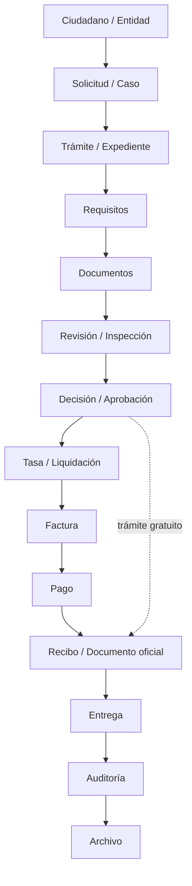
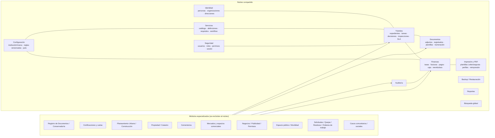
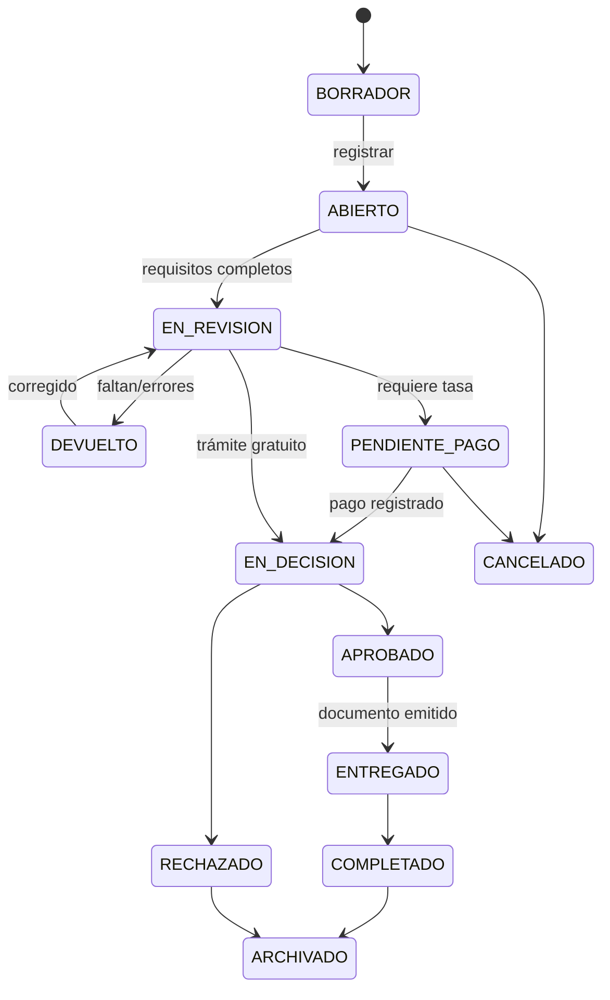
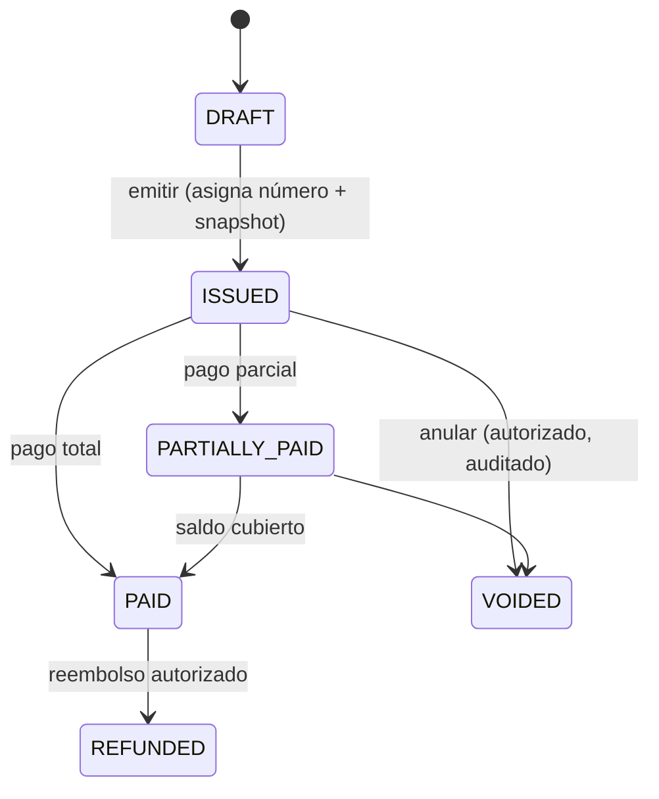

# Mapa de dominio de SIRMAX

Visión de alto nivel de los contextos del dominio y cómo se conectan a la **columna vertebral
compartida**. Detalle de entidades en [`erd.md`](./erd.md); vocabulario en [`glossary.md`](./glossary.md).

## 1. Columna vertebral (todos los módulos la reutilizan)

Reglas que el mapa hace explícitas:

- No todo trámite llega a `Tasa` (`GRATUITO`, `PAGO_EXTERNO`).
- `Tasa` ≠ `Factura` ≠ `Pago` ≠ `Movimiento de caja` ≠ `Recibo`.
- Un `Documento` adjunto no es un `Documento registrado`.
- La `Auditoría` acompaña cada transición relevante, no solo el final.

## 2. Contextos del dominio

## 3. Qué aporta cada módulo especializado

| Módulo | Entidades propias | Qué reutiliza del núcleo |
| --- | --- | --- |
| **Registro de Documentos / Conservaduría** | Documento registrado, libro/folio, anotación, copia certificada | Trámite, tasa→factura→pago, numeración, auditoría, búsqueda |
| **Certificaciones y cartas** | Plantilla de certificado, variables, política de reimpresión/anulación | Trámite, numeración, tasa/factura, firma/decisión, PDF/impresión |
| **Planeamiento Urbano / Construcción** | Proyecto, tipo de proyecto, planos, etapas de revisión, resolución | Propiedad/parcela, inspección, decisión, tasa por área/tipo, permiso (documento) |
| **Propiedad / Catastro** | Parcela, titularidad, estado de propiedad municipal, referencias legales | Persona/organización, contratos/arrendamientos, certificaciones, historial |
| **Cementerios** | Cementerio→sección→manzana→lote/nicho, ocupante/fallecido, inhumación, exhumación, disponibilidad | Contrato/concesión, tasa periódica/única, factura/pago, documentos, auditoría |
| **Mercados y espacios comerciales** | Mercado→zona→casilla, comerciante, acuerdo de ocupación, morosidad | Contrato, tasa periódica, factura/pago, inspección, reasignación/traspaso |
| **Negocios / Publicidad / Permisos** | Permiso/licencia, actividad, dimensiones/aforo, condiciones, renovación | Motor permiso+inspección, tasa (letrero/valla/tarima…), flujo de aprobación, documento |
| **Espacio público / Movilidad** | Permiso de uso de vía, cierre parcial, vehículo/placa, ventana horaria, ruta | Inspección, tasa por duración/ubicación, documento de permiso |
| **Operaciones (Solicitudes/Quejas/Residuos)** | Solicitud ciudadana, canal, categoría, asignación a cuadrilla, SLA, orden de trabajo, activo | Trámite (variante no financiera), asignación, seguimiento, cierre, auditoría |
| **Casos comunitarios / sociales** | Institución comunitaria, programa, carta de domicilio de junta de vecinos | Caso no financiero, certificación, auditoría |

## 4. Ciclos de vida principales

## 5. Fronteras que no se cruzan

- `domain` no conoce JavaFX, JDBC ni Google Drive.
- Los módulos especializados **no** definen su propia arquitectura de finanzas/auditoría/documentos:
  usan la del núcleo.
- Las reglas específicas de país (identidad, moneda, requisitos legales) viven en el adaptador de
  país, no en el núcleo.
- Nada de reglas legales jurisdiccionales quemadas: si el contexto no las establece, se hacen
  configurables y se marcan para verificación legal.
