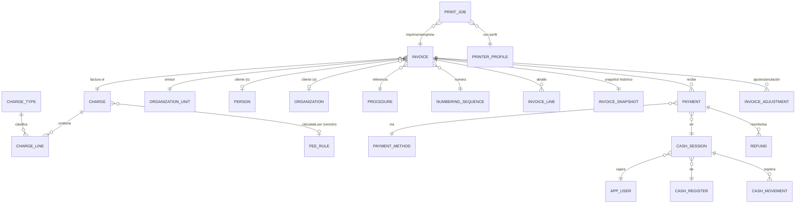
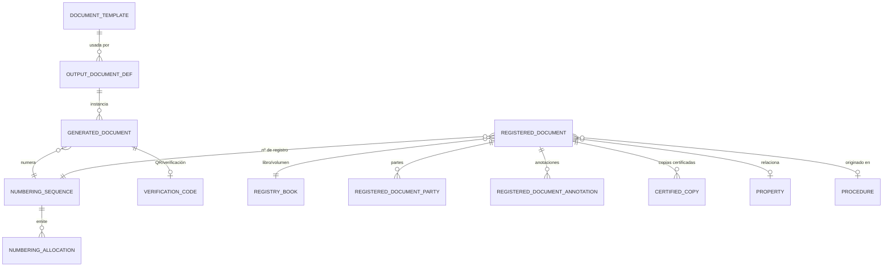
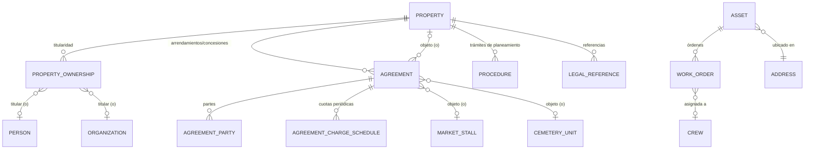
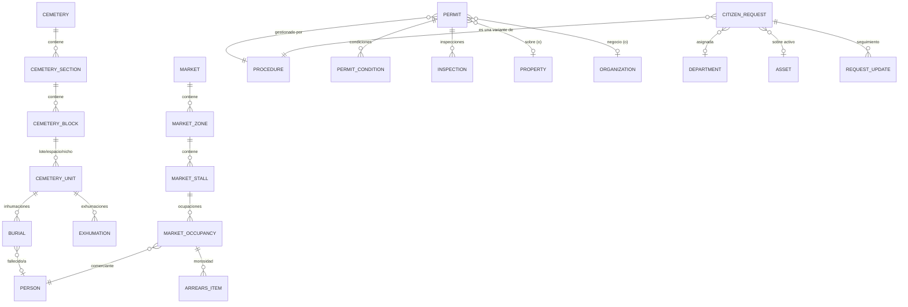
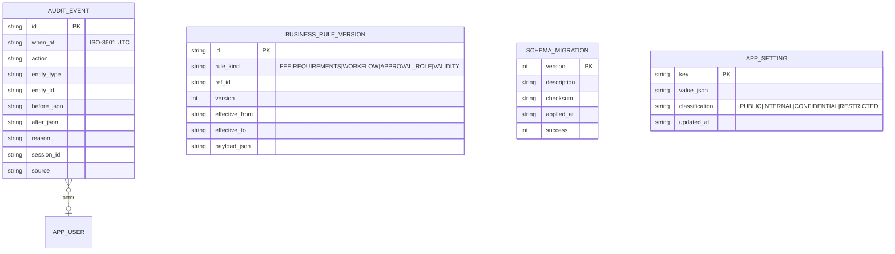

# ERD inicial de SIRMAX

Modelo entidad-relación **inicial** para orientar la Fase 3 (dominio + base de datos). No es el
esquema final: la fuente de verdad del esquema serán las migraciones en
[`database/migrations/`](../../database/migrations/). Convenciones de tipos/dinero/numeración en
[`DATABASE.md`](../../DATABASE.md).

## 1. Núcleo — identidad, servicios, trámites

```mermaid
erDiagram
    ORGANIZATION_UNIT ||--o{ DEPARTMENT : tiene
    ORGANIZATION_UNIT ||--|| INSTITUTION_PROFILE : "marca/branding"
    DEPARTMENT ||--o{ APP_USER : "adscribe"
    APP_USER ||--o{ USER_ROLE : tiene
    ROLE ||--o{ USER_ROLE : asigna
    ROLE ||--o{ ROLE_PERMISSION : concede
    PERMISSION ||--o{ ROLE_PERMISSION : "en"

    PERSON ||--o{ IDENTIFICATION : posee
    ORGANIZATION ||--o{ IDENTIFICATION : posee
    PERSON ||--o{ CONTACT : tiene
    ORGANIZATION ||--o{ CONTACT : tiene
    PERSON ||--o{ ADDRESS : "reside/localiza"
    ORGANIZATION ||--o{ ADDRESS : "domicilia"

    SERVICE_CATEGORY ||--o{ SERVICE_DEFINITION : agrupa
    SERVICE_DEFINITION ||--o{ SERVICE_DEFINITION_VERSION : versiona
    SERVICE_DEFINITION_VERSION ||--o{ REQUIREMENT_DEF : declara
    SERVICE_DEFINITION_VERSION ||--o{ WORKFLOW_STEP_DEF : define
    SERVICE_DEFINITION_VERSION ||--o{ FEE_RULE : "tarifa"
    SERVICE_DEFINITION_VERSION ||--o{ OUTPUT_DOCUMENT_DEF : produce
    SERVICE_DEFINITION_VERSION }o--|| NUMBERING_SEQUENCE : "numera trámite"
    DEPARTMENT ||--o{ SERVICE_DEFINITION : "responsable (no exclusivo)"

    PROCEDURE }o--|| SERVICE_DEFINITION_VERSION : "instancia de"
    PROCEDURE }o--|| PERSON : "solicitante (o)"
    PROCEDURE }o--|| ORGANIZATION : "solicitante (o)"
    PROCEDURE }o--o| DEPARTMENT : "asignado a"
    PROCEDURE }o--o| APP_USER : "responsable"
    PROCEDURE ||--o{ PROCEDURE_REQUIREMENT : "checklist"
    PROCEDURE ||--o{ PROCEDURE_TASK : tareas
    PROCEDURE ||--o{ PROCEDURE_TRANSITION : historial
    PROCEDURE ||--o{ REVIEW : revisiones
    PROCEDURE ||--o{ INSPECTION : inspecciones
    PROCEDURE ||--o{ DECISION : decisiones
    PROCEDURE ||--o{ ATTACHED_DOCUMENT : adjuntos
    PROCEDURE ||--o{ GENERATED_DOCUMENT : "documentos oficiales"
    PROCEDURE ||--o{ CHARGE : "tasas/liquidaciones"
    PROCEDURE ||--o{ NOTE : notas
    REQUIREMENT_DEF ||--o{ PROCEDURE_REQUIREMENT : "materializa"
```

## 2. Finanzas — cargo → factura → pago → caja

Notas:

- `INVOICE.status` ∈ `{DRAFT, ISSUED, PARTIALLY_PAID, PAID, VOIDED, REFUNDED}`; al pasar a `ISSUED` se
  crea `INVOICE_SNAPSHOT` (identidad institución/cliente, líneas, precios, totales, moneda) y se
  consume un número de `NUMBERING_SEQUENCE` de forma segura ante concurrencia.
- Importes en `*_minor INTEGER` + `currency TEXT(3)`. Nunca `REAL`.
- `PRINT_JOB` con `kind ∈ {ORIGINAL, COPY, REPRINT}`; una reimpresión **no** crea `INVOICE` ni
  `PAYMENT` nuevos y queda auditada.

## 3. Documentos y numeración

## 4. Propiedad, contratos y activos

## 5. Módulos especializados (selección)

## 6. Auditoría, configuración y migraciones

## 7. Estado de archivo (transversal)

Muchas entidades llevan un `archive_status` ∈ `{ACTIVE, COMPLETED, CLOSED, ARCHIVED, VOID,
CANCELLED}`. **No** se hace `DELETE` de registros con valor legal/financiero.

## 8. Pendiente de decidir en Fase 3

- PK `TEXT` UUIDv7 vs `INTEGER` por tabla (documentar por tabla).
- Estrategia exacta de almacenamiento de configuración flexible (columnas tipadas + JSON validado).
- Adopción de Flyway Community vs runner propio de migraciones.
- Modelo de adjuntos: BLOB en SQLite vs ficheros en disco referenciados (probable: ficheros +
  hash + ruta relativa a la carpeta de datos).
